# ⭐️[일정 관리 앱 서버 구현 프로젝트]⭐️

## ⚙️ 개발 환경 및 라이브러리
### 📌 개발 환경
✔️ 언어: Java 17 
✔️ 빌드 도구: Gradle 
✔️ 프레임워크: Spring Boot 3.4.1 
✔️ 데이터베이스: MySQL 
### 📌 사용 라이브러리
✔️ `spring-boot-starter-web` 
✔️ `spring-boot-starter-data-jdbc` 
✔️ `spring-boot-starter-validation` 
✔️ `lombok` 

## 👉🏻 ERD
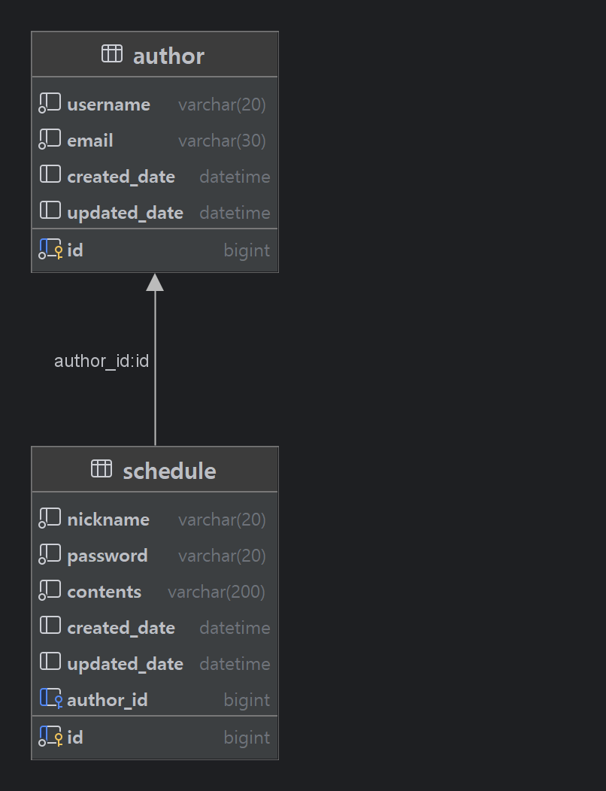

## 👉🏻 API 명세서
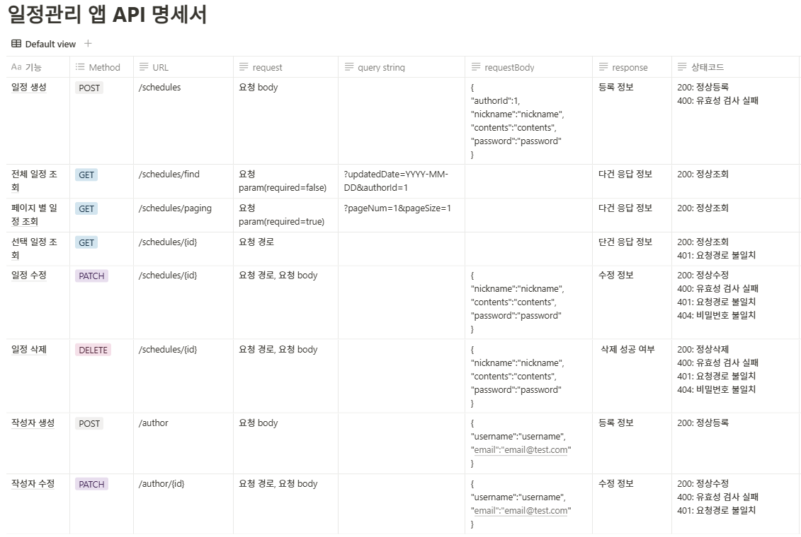

## 👉🏻구현 사항
[x] 일정 생성 
[x] 일정 조회(전체 일정, 수정일, 작성자명, id 기준) 
[x] 선택 일정 삭제 
[x] 선택 일정 수정 
[x] 작성자 테이블 설계 및 일정 테이블에 외래키 설정 
[x] Page 객체를 활용한 페이지별 일정 목록 조회(페이지 번호, 페이지 크기 기준) 
[x] @ExceptionHandler를 활용한 Custom Exception 생성 예외처리 
[x] @Valid, @Pattern을 통해 유효성 검증 

## 👉🏻 POSTMAN 확인

  
<b>작성자 생성</b>

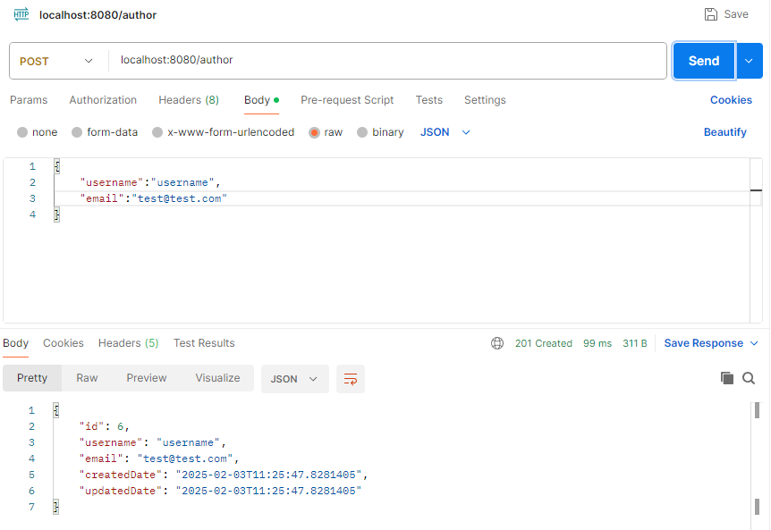

  
<b>작성자 수정</b>

  
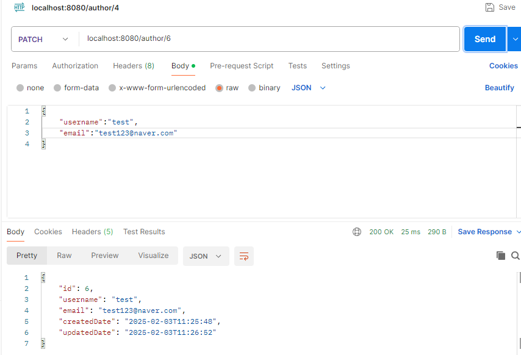

  
<b>일정 생성</b>

  

  
<b>일정 수정</b>

  
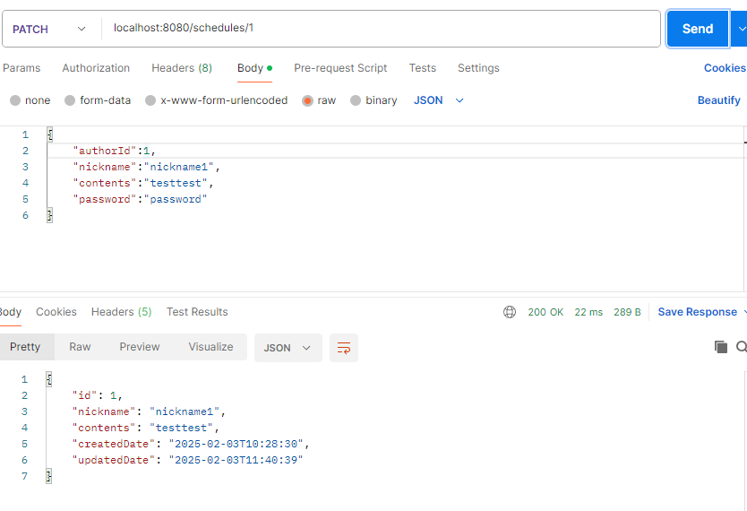

  
<b>일정 삭제</b>

  
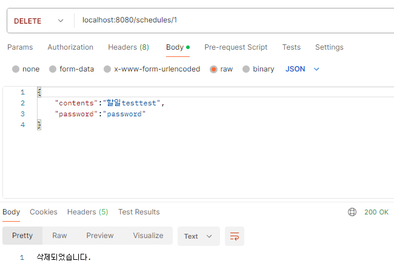

  
<b>선택 일정 조회</b>

  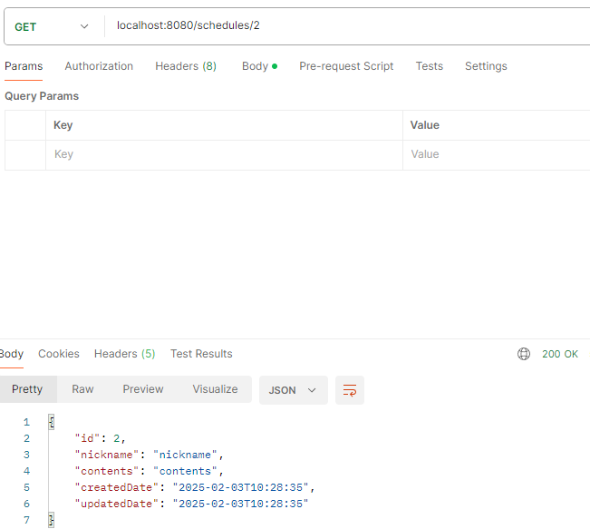

  
<b>전체 일정 조회</b>

  
- 조건 없이 조회하는 경우
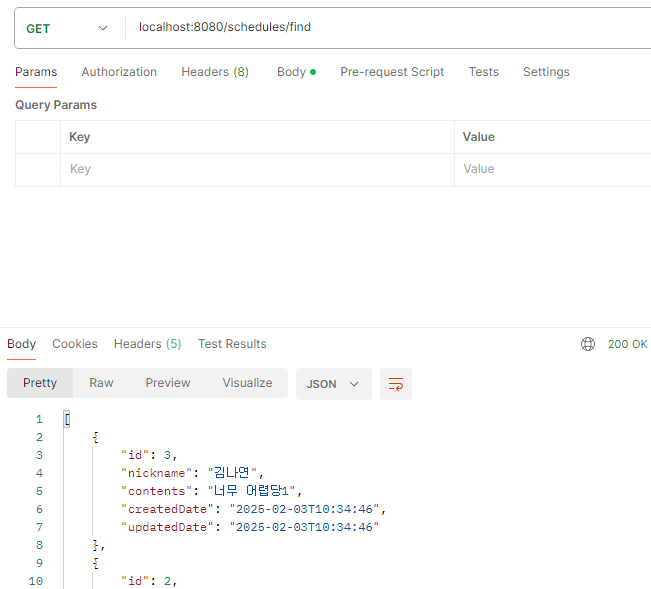
- updatedDate 으로만 조회하는 경우
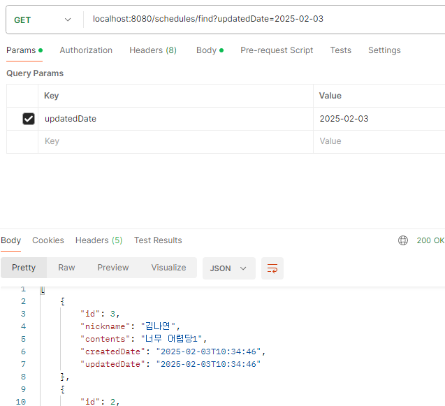
- 모든 조건으로 조회하는 경우
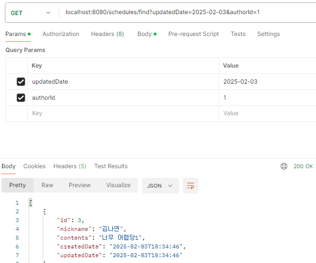

  
<b>페이지별 일정 조회</b>

  
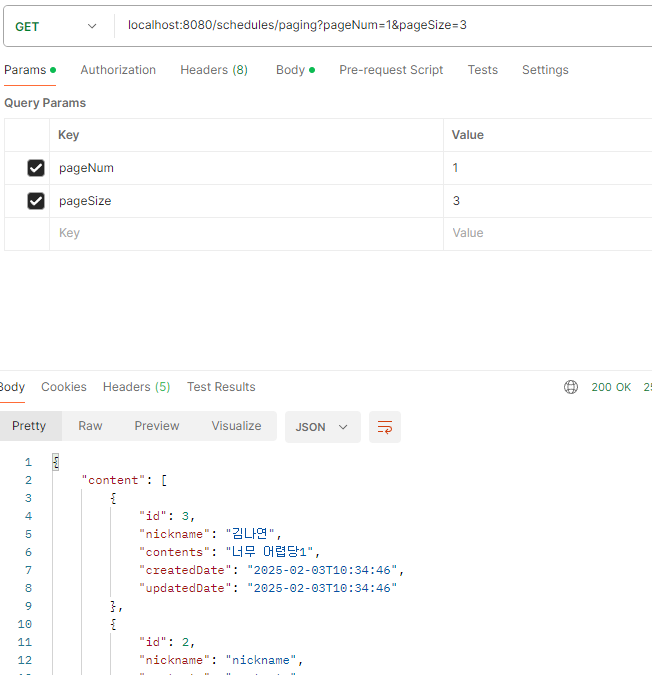

  
<b>예외 발생 시 response</b>

- 이메일 형식이 올바르지 않은 경우
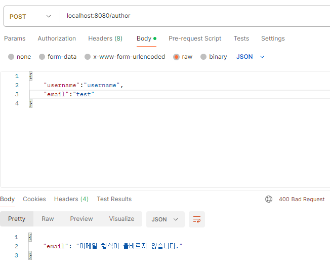
- body에 필수 입력값을 입력하지 않은 경우
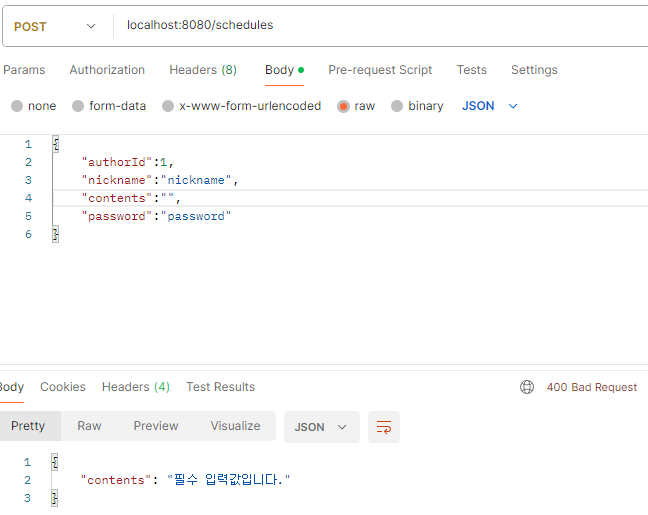
- 올바르지 않은 id 경로를 입력한 경우

- 비밀번호가 올바르지 않은 경우
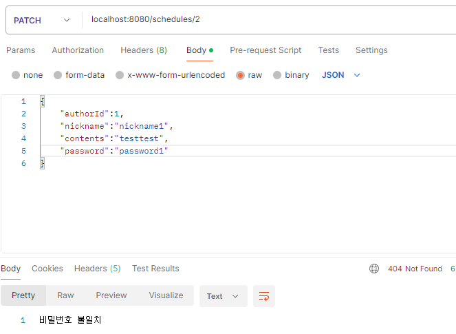

 

